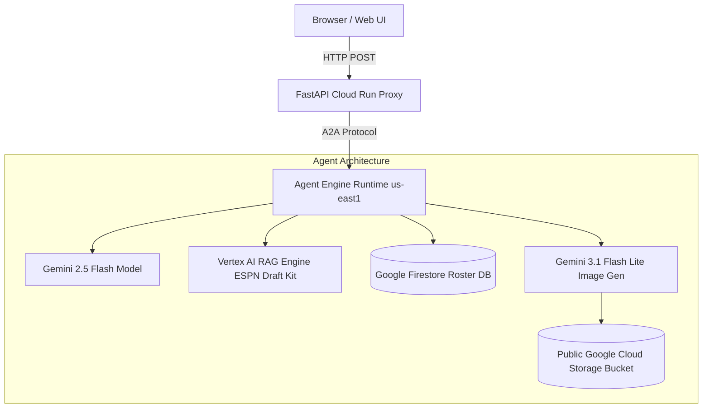

# 🏈 Fantasy Football Draft & Lineup Assistant

> An autonomous AI agent built with the **Google Agent Development Kit (ADK)** that helps fantasy managers dominate draft day with **ESPN Draft Kit RAG knowledge**, **Firestore roster tracking**, **real-time player news**, **custom Imagen 3 welcome banners**, and an **interactive Cloud Run web interface** with draft confetti celebrations!

---

## 🎬 Demo Video & UI


*(Full screen capture demo: [`fantasy_football_demo.webm`](fantasy_football_demo.webm))*

---

## 🚀 Live App & Deployment

- **🌐 Live Cloud Run Web UI**: [https://fantasy-football-frontend-103761399075.us-east1.run.app](https://fantasy-football-frontend-103761399075.us-east1.run.app)
- **📦 GitHub Repository**: [https://github.com/zkovar/buildwithgemini-fantasy-football-agent](https://github.com/zkovar/buildwithgemini-fantasy-football-agent)
- **⚡ A2A Protocol Endpoint**: Agent Engine GA 1.1.0 (`us-east1`)

---

## 🔥 Key Features

### 1. 📚 ESPN Draft Kit Knowledge Base (Vertex AI RAG Engine)
- Grounded on official ESPN NFL Draft Kit cheat sheets:
  - *NFL26 Ultimate Draft Cheat Sheet*
  - *NFL26 PPR Rankings & Cheat Sheet*
  - *NFL26 Top 300 PPR Cheat Sheet*
- Answers strategic draft questions on sleepers, busts, PPR tiers, positional advantages, and Hero RB / Zero RB strategies using serverless **Vertex AI RAG Engine**.

### 2. 🏈 Live Roster & Board Management (Google Firestore)
- Persists drafted and available player records in Firestore.
- Tracks player position, team, ADP, tier, projected fantasy points, and custom manager notes.

### 3. 🏥 Real-Time Injury & Player News Search
- Fetches up-to-date practice participation, medical clearance, and injury statuses for any player on demand.

### 4. 🖼️ Custom Welcome Banner Generation (Imagen 3 / Gemini)
- When a manager drafts a player, the agent calls `gemini-3.1-flash-lite-image` to generate a custom **"WELCOME TO THE SQUAD"** celebration image.
- Saves artifacts locally for ADK Playground and uploads image bytes directly to a public **Google Cloud Storage** bucket (`gs://fantasy-football-assets-qwiklabs-gcp-04`) for web display.

### 5. 🎉 Interactive Sports UI & A2UI
- Deployed on **Cloud Run** with a FastAPI backend proxy communicating over the **A2A protocol**.
- Rendered with modern stadium turf styling, A2UI card support, and **festive confetti animations** that rain down on draft picks!

---

## 🛠️ Architecture & Tech Stack



- **Core Agent**: Python 3.13, Google ADK (`google-adk`), Gemini 2.5 Flash
- **Database**: Google Cloud Firestore (`roles/datastore.user`)
- **Knowledge Retrieval**: Vertex AI RAG Engine (`vertexai.rag`)
- **Image Generation**: `gemini-3.1-flash-lite-image` on Google Vertex AI
- **Asset Hosting**: Google Cloud Storage (`roles/storage.objectAdmin`)
- **Deployment**: Agent Runtime GA 1.1.0 on Vertex AI Agent Engine & Cloud Run

---

## 💻 Local Development & Setup

### 1. Prerequisites
- Python 3.11+
- `uv` package manager
- `google-agents-cli` (`uv tool install google-agents-cli`)
- Google Cloud SDK (`gcloud`)

### 2. Installation
```bash
git clone https://github.com/zkovar/buildwithgemini-fantasy-football-agent.git
cd buildwithgemini-fantasy-football-agent
agents-cli install
```

### 3. Run Agent Locally
```bash
agents-cli playground
```

### 4. Run Frontend Locally
```bash
cd frontend
export AGENT_ENGINE_RESOURCE_NAME="projects/103761399075/locations/us-east1/reasoningEngines/8651889873201922048"
export AGENT_DIRECTORY="app"
uv run python main.py
```
Open [http://localhost:8080](http://localhost:8080) to test the UI!

---

## 🚀 Deployment Commands

### Deploy Agent to Agent Runtime:
```bash
agents-cli deploy
```

### Deploy Frontend to Cloud Run:
```bash
cd frontend
gcloud run deploy fantasy-football-frontend \
  --source . \
  --region us-east1 \
  --allow-unauthenticated \
  --set-env-vars AGENT_ENGINE_RESOURCE_NAME="projects/103761399075/locations/us-east1/reasoningEngines/8651889873201922048",AGENT_DIRECTORY="app"
```

---

## 📄 License
MIT License. Built for the **Build with Gemini** Agentic AI Challenge.
